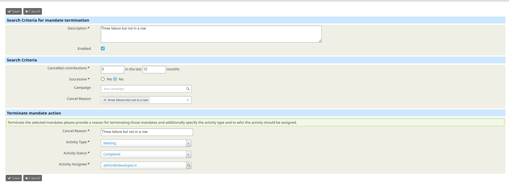
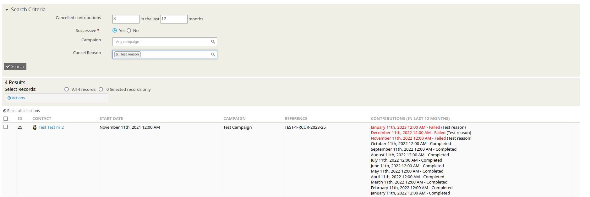

# SEPA Terminate Mandates

Terminate mandates automatically based on a set of criteria or with a search.

The extension is licensed under [AGPL-3.0](LICENSE.txt).

## Usage

You can use this extension to automatically terminate mandates. To do so go to Administer > CiviContribute > Automatically Terminate SEPA Mandates.

Or you can manually terminate mandates by going to Contributions > Find Mandates to terminate.

## Requirements

[CiviSEPA - SEPA Direct Debit Extension](https://civicrm.org/extensions/civisepa-sepa-direct-debit-extension)

## Funded by

* [Amnesty International Flanders](https://www.amnesty-international.be)
